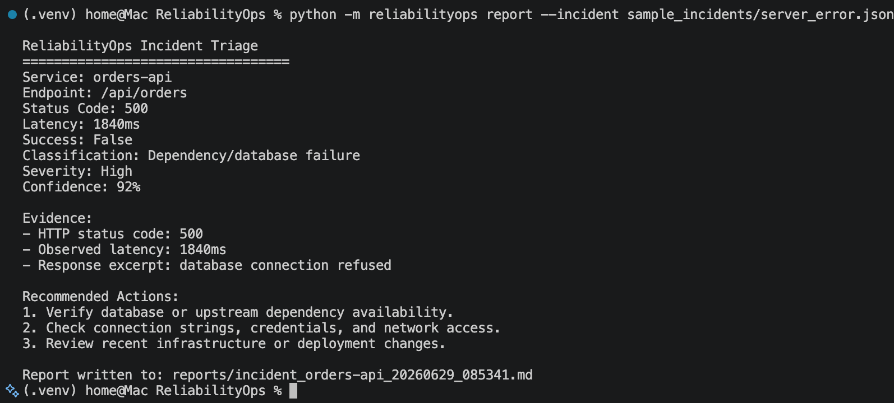
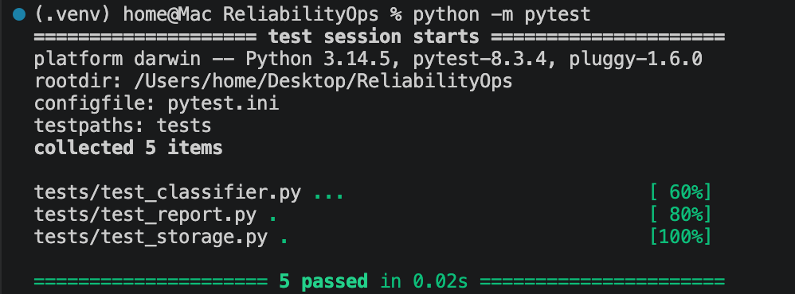

# ReliabilityOps

ReliabilityOps is a Python CLI tool for API incident triage and runbook automation. It runs synthetic API checks, detects failed endpoints, classifies likely root causes, stores incident history in SQLite, and generates Markdown incident reports with evidence and remediation steps.

## Problem

Engineering and support teams often spend time manually checking API status codes, latency, response bodies, missing configuration values, and dependency failures during incidents. ReliabilityOps automates the first-pass triage process so teams can identify likely causes faster and follow a consistent runbook.

## Features

* Run synthetic API endpoint checks from a YAML config
* Validate HTTP status codes, latency thresholds, and required response fields
* Classify failures across common production incident categories
* Extract high-signal evidence from failed checks
* Generate Markdown incident reports
* Store incident history in SQLite
* Validate classifier behavior with pytest
* Run automated tests with GitHub Actions

## Demo

### CLI Incident Triage Output



### Automated Test Results



## Failure Categories

| Category                         | Example                                                         |
| -------------------------------- | --------------------------------------------------------------- |
| Authentication failure           | `401`, `403`, missing token, invalid credentials                |
| Timeout / latency breach         | Slow endpoint, gateway timeout, request exceeded threshold      |
| HTTP 5xx server error            | `500`, `502`, `503`, `504`                                      |
| Schema mismatch                  | Required field missing from response                            |
| Missing environment/config value | Missing API key, missing environment variable, invalid config   |
| Dependency/database failure      | Database unavailable, connection refused, upstream service down |

## Tech Stack

* Python
* PyYAML
* Requests or HTTPX
* SQLite
* Pytest
* GitHub Actions
* Markdown

## Project Structure

```text
reliabilityops/
├── README.md
├── LICENSE
├── requirements.txt
├── .gitignore
├── .env.example
│
├── reliabilityops/
│   ├── __init__.py
│   ├── cli.py
│   ├── checker.py
│   ├── classifier.py
│   ├── report.py
│   ├── storage.py
│   ├── models.py
│   └── utils.py
│
├── configs/
│   └── checks.yaml
│
├── sample_incidents/
│   ├── auth_failure.json
│   ├── timeout_failure.json
│   ├── schema_failure.json
│   ├── server_error.json
│   ├── config_failure.json
│   └── dependency_failure.json
│
├── reports/
│   └── sample_incident_report.md
│
├── tests/
│   ├── test_classifier.py
│   ├── test_report.py
│   └── test_storage.py
│
├── screenshots/
│   ├── cli_output.png
│   └── incident_report.png
│
└── .github/
    └── workflows/
        └── tests.yml
```

## Installation

Clone the repository:

```bash
git clone https://github.com/ma-dev-usa/ReliabilityOps.git
cd ReliabilityOps
```

Create and activate a virtual environment:

```bash
python3 -m venv .venv
source .venv/bin/activate
```

Install dependencies:

```bash
pip install -r requirements.txt
```

## Example Configuration

Create endpoint checks in `configs/checks.yaml`.

```yaml
services:
  - name: orders-api
    url: "https://example.com/api/orders"
    method: GET
    expected_status: 200
    timeout_ms: 1000
    required_fields:
      - id
      - status

  - name: auth-api
    url: "https://example.com/api/login"
    method: POST
    expected_status: 200
    timeout_ms: 1000
    required_fields:
      - token
```

## Usage

Run API checks:

```bash
python -m reliabilityops run --config configs/checks.yaml
```

Generate a report from a sample incident:

```bash
python -m reliabilityops report --incident sample_incidents/server_error.json
```

View stored incident history:

```bash
python -m reliabilityops history
```

## Example CLI Output

```text
ReliabilityOps Incident Triage

Service: orders-api
Endpoint: /api/orders
Status Code: 500
Latency: 1840ms
Success: false

Classification: Dependency/database failure
Severity: High
Confidence: 92%

Evidence:
- HTTP 500 returned from /api/orders
- Response body contains "connection refused"
- Latency exceeded 1000ms threshold

Recommended Actions:
1. Verify database availability
2. Check connection string and secrets
3. Review recent deployment logs
4. Roll back if failures began after the latest release
```

## Example Incident Report

ReliabilityOps generates Markdown reports like this:

```markdown
# Incident Report

## Summary

ReliabilityOps detected a failed API check for `orders-api`. The endpoint returned HTTP 500 and exceeded the configured latency threshold.

## Affected Service

- Service: orders-api
- Endpoint: /api/orders
- Status Code: 500
- Latency: 1840ms

## Likely Root Cause

Dependency/database failure

## Severity

High

## Confidence

92%

## Evidence

- HTTP 500 returned from /api/orders
- Response body contains "connection refused"
- Latency exceeded 1000ms threshold

## Recommended Actions

1. Verify database availability
2. Check connection string and secrets
3. Review recent deployment logs
4. Roll back if failures began after the latest release

## Generated By

ReliabilityOps
```

## Testing

Run the test suite:

```bash
pytest
```

Example test coverage:

* Classifies authentication failures from `401` and `403` responses
* Classifies timeout failures from high latency or `504` responses
* Classifies dependency failures from database-related error text
* Verifies Markdown report generation
* Verifies SQLite incident storage

## GitHub Actions

The project includes a GitHub Actions workflow that runs tests on every push and pull request.

```yaml
name: Tests

on:
  push:
  pull_request:

jobs:
  test:
    runs-on: ubuntu-latest

    steps:
      - name: Checkout repo
        uses: actions/checkout@v4

      - name: Set up Python
        uses: actions/setup-python@v5
        with:
          python-version: "3.11"

      - name: Install dependencies
        run: |
          pip install -r requirements.txt

      - name: Run tests
        run: |
          pytest
```

## Design Overview

ReliabilityOps is organized into four main components:

### 1. Checker

The checker runs synthetic API requests, measures latency, validates expected responses, and returns structured check results.

### 2. Classifier

The classifier evaluates failed checks and assigns an incident category, severity, confidence score, evidence, and recommended actions.

### 3. Reporter

The reporter converts structured incident classifications into Markdown reports that can be used for incident review or handoff.

### 4. Storage

The storage layer writes incident summaries to SQLite so repeated failures can be reviewed over time.

## Example Incident Object

```json
{
  "service": "orders-api",
  "endpoint": "/api/orders",
  "status_code": 500,
  "latency_ms": 1840,
  "success": false,
  "response_excerpt": "database connection refused"
}
```

## Why This Project Matters

ReliabilityOps demonstrates practical engineering skills used in production support, QA automation, integration engineering, DevOps, and backend software roles:

* API testing and validation
* Incident triage
* Root-cause classification
* Reliability automation
* Runbook generation
* SQLite persistence
* CLI development
* Automated testing
* CI workflow setup

## Resume Summary

ReliabilityOps can be summarized as:

> Built an API reliability automation tool that executed synthetic endpoint checks, classified failures across 6 incident categories, and generated Markdown runbook reports with evidence and remediation steps.

Additional resume bullets:

* Implemented Python-based incident classification using YAML-defined service checks, latency thresholds, response validation, and SQLite result storage to support repeatable production-style diagnostics.
* Automated pytest validation and GitHub Actions CI workflows to verify failure detection logic across authentication, timeout, schema, server, configuration, and dependency failures.

## Future Improvements

* Slack or email incident notifications
* Dockerized mock API environment
* OpenAPI schema validation
* Web dashboard for incident history
* GitHub Actions PR comments
* Trend analysis for repeated endpoint failures
* Severity scoring based on service impact
* Export reports as PDF

## License

MIT License
